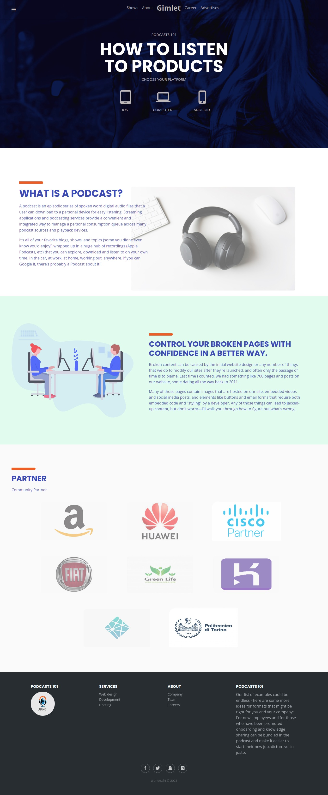

# PODCAST 101

Simple PODCASTS players website , built with pure HTML, CSS , BOOTSTRAP, GOOGLEFONTS, FONTICONS.

## How to install

1. Clone the repository

```
https://github.com/TsigeWonwosen/Podcast-101.git

```

2. Change directory to Podcast-101

```
cd Podcast-101

```

3. Open with VS CODE

```
code .

```

4. Open the index.html with liveServer

## Project


